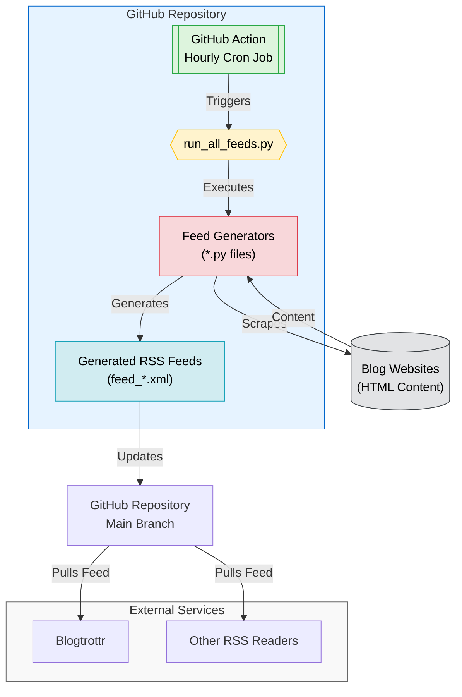

# RSS Feed Generator <!-- omit in toc -->

## tl;dr Available RSS Feeds <!-- omit in toc -->

| Blog                                                                                      | Feed                                                                                                                                                 |
| ----------------------------------------------------------------------------------------- | ---------------------------------------------------------------------------------------------------------------------------------------------------- |
| [Anthropic News](https://www.anthropic.com/news)                                          | [feed_anthropic_news.xml](https://raw.githubusercontent.com/whkelvin/rss/main/feeds/feed_anthropic_news.xml)                                   |
| [Anthropic Engineering](https://www.anthropic.com/engineering)                            | [feed_anthropic_engineering.xml](https://raw.githubusercontent.com/whkelvin/rss/main/feeds/feed_anthropic_engineering.xml)                     |
| [Anthropic Research](https://www.anthropic.com/research)                                  | [feed_anthropic_research.xml](https://raw.githubusercontent.com/whkelvin/rss/main/feeds/feed_anthropic_research.xml)                           |
| [Anthropic Frontier Red Team](https://red.anthropic.com/)                                 | [feed_anthropic_red.xml](https://raw.githubusercontent.com/whkelvin/rss/main/feeds/feed_anthropic_red.xml)                                     |
| [Claude Code Changelog](https://github.com/anthropics/claude-code/blob/main/CHANGELOG.md) | [feed_anthropic_changelog_claude_code.xml](https://raw.githubusercontent.com/whkelvin/rss/main/feeds/feed_anthropic_changelog_claude_code.xml) |
| [Anthropic](https://www.anthropic.com/)                                                   | [feed_anthropic.xml](https://raw.githubusercontent.com/whkelvin/rss/main/feeds/feed_anthropic.xml)                                             |
| [OpenAI Developer Blog](https://developers.openai.com/blog)                               | [feed_openai_developer.xml](https://raw.githubusercontent.com/whkelvin/rss/main/feeds/feed_openai_developer.xml)                               |
| [OpenAI Research](https://openai.com/news/research/)                                      | [feed_openai_research.xml](https://raw.githubusercontent.com/whkelvin/rss/main/feeds/feed_openai_research.xml)                                 |
| [Paul Graham's Articles](https://www.paulgraham.com/articles.html)                        | [feed_paulgraham.xml](https://raw.githubusercontent.com/whkelvin/rss/main/feeds/feed_paulgraham.xml)                                           |
| [Claude Blog](https://claude.com/blog)                                                    | [feed_claude.xml](https://raw.githubusercontent.com/whkelvin/rss/main/feeds/feed_claude.xml)                                                   |
| [Cursor Blog](https://cursor.com/blog)                                                   | [feed_cursor.xml](https://raw.githubusercontent.com/whkelvin/rss/main/feeds/feed_cursor.xml)                                                   |
| [Google Developers Blog - AI](https://developers.googleblog.com/search/?technology_categories=AI) | [feed_google_ai.xml](https://raw.githubusercontent.com/whkelvin/rss/main/feeds/feed_google_ai.xml)                                             |

### What is this?

You know that blog you like that doesn't have an RSS feed and might never will?

🙌 **You can use this repo to create a RSS feed for it!** 🙌

## Table of Contents <!-- omit in toc -->

- [Quick Start](#quick-start)
  - [Subscribe to a Feed](#subscribe-to-a-feed)
  - [Request a new Feed](#request-a-new-feed)
- [Create a new a Feed](#create-a-new-a-feed)
- [How It Works](#how-it-works)
  - [For Developers 👀 only](#for-developers--only)

## Quick Start

### Subscribe to a Feed

- Go to the [feeds directory](./feeds).
- Find the feed you want to subscribe to.
- Use the **raw** link for your RSS reader. Example:

  ```text
    https://raw.githubusercontent.com/whkelvin/rss/main/feeds/feed_claude.xml
  ```

- Use your RSS reader of choice to subscribe to the feed (e.g., [Blogtrottr](https://blogtrottr.com/)).

### Request a new Feed

Want me to create a feed for you?

[Open a GitHub issue](https://github.com/whkelvin/rss/issues/new) and include the blog URL.

## Create a new a Feed

1. Download the HTML of the blog you want to create a feed for.
2. Open Claude Code CLI
3. Tell claude to:

```bash
Use @cmd_rss_feed_generator.md to convert @<html_file>.html to a RSS feed for <blog_url>.
```

## How It Works



### For Developers 👀 only

- Open source and community-driven 🙌
- Simple Python + GitHub Actions 🐍
- AI tooling for easy contributions 🤖
- Learn and contribute together 🧑‍🎓
- Streamlines the use of Claude, Claude Projects, and Claude Sync
